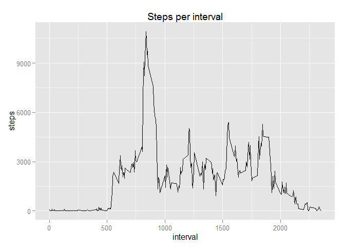

# Reproducible Research: Peer Assessment 1

## Loading and preprocessing the data


```r
library(dplyr)
library(ggplot2)
library(lubridate)

df <- read.csv("activity.csv", stringsAsFactors = FALSE)
df <- df %>%
    mutate(dateTime = ymd_hm(paste(
        date,
        as.character(df$interval %/% 100),
        as.character(df$interval %% 100),
        sep=" "
    )))
```

## What is mean total number of steps taken per day?

```r
# group steps by days
dfDays <- df %>%
    na.omit() %>%
    group_by(date) %>%
    summarise(total_steps = sum(steps))

# plot a histogram of total number of steps per day
qplot(dfDays$total_steps, geom="histogram")
```

 

```r
# calculate mean and median of total number of steps per day
mean(dfDays$total_steps)
```

```
## [1] 10766.19
```

```r
median(dfDays$total_steps)
```

```
## [1] 10765
```


## What is the average daily activity pattern

```r
# group by interval
dfInterval <- df %>%
    na.omit() %>%
    group_by(interval) %>%
    summarise(total_steps = sum(steps))

# time plot of total number of steps per interval
qplot(interval, total_steps, data=dfInterval, geom="line")
```

 

```r
# max interval
dfInterval[which.max(dfInterval$total_steps),]
```

```
## Source: local data frame [1 x 2]
## 
##   interval total_steps
##      (int)       (int)
## 1      835       10927
```

## Imputing missing values

```r
# number of missing values
numMissingValues <- sum(is.na(df$steps))

# calculate averages
stepsNoNA <- df$steps
stepsNoNA[is.na(stepsNoNA)] <- 0
dfNoNA <- transform(
    df, meanStepsInterval = ave(
        stepsNoNA, interval, FUN = mean, na.rm=T
    )
)
dfNoNA$steps[is.na(dfNoNA$steps)] <- dfNoNA$meanSteps[is.na(dfNoNA$steps)]

# group steps by days
dfDaysNoNA <- dfNoNA %>%
  group_by(date) %>%
  summarise(total_steps = sum(steps))

# plot a histogram of total number of steps per day
qplot(dfDaysNoNA$total_steps, geom="histogram")
```

 

```r
# calculate mean and median of total number of steps per day
mean(dfDaysNoNA$total_steps)
```

```
## [1] 10581.01
```

```r
median(dfDaysNoNA$total_steps)
```

```
## [1] 10395
```

## Are there differences in activity patterns between weekdays and weekends?

```r
# calculate if date is a weekday
dfNoNA <- dfNoNA %>%
    mutate(dayType = as.factor(ifelse(wday(dfNoNA$dateTime, label=T) %in% c("Sat", "Sun"), "weekday", "weekend")))

# group by interval
dfIntervalNoNA <- dfNoNA %>%
  group_by(interval, dayType) %>%
  summarise(total_steps = sum(steps))

# time plot of total number of steps per interval
qplot(interval, total_steps, data=dfIntervalNoNA, facets = .~dayType, geom="line")
```

 
